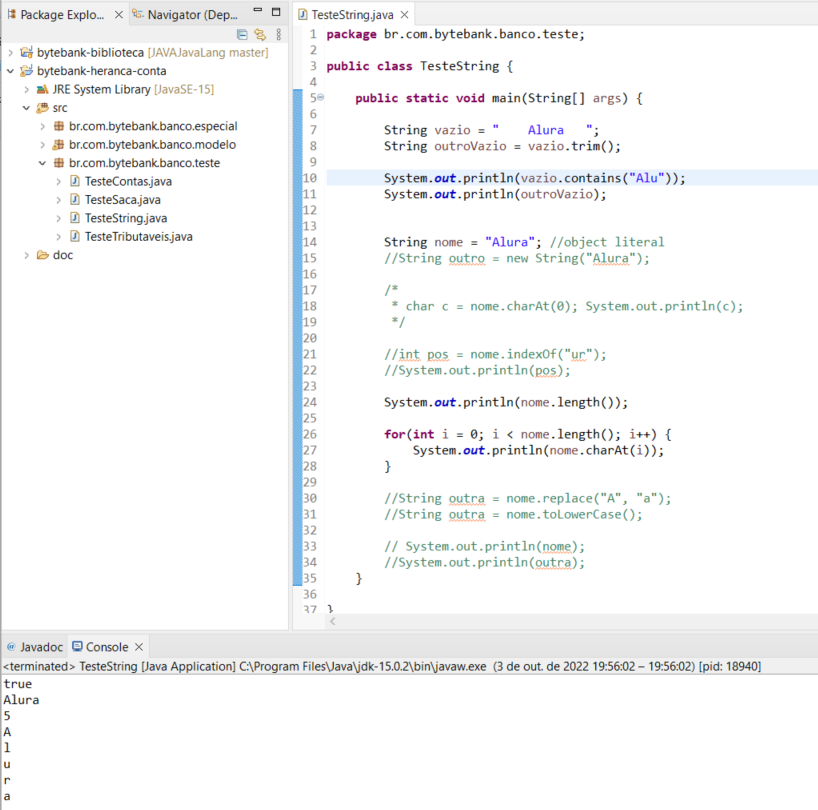

## Java e java.lang: programe com a classe Object e String

**Faça esse curso de Java e:**

- Use imports e organize o seu código através de packages

- Saiba o significado de todos os modificadores de visibilidade tratamento de exceções

- Documente e distribuia a sua biblioteca

- Conheça o java.lang

- Entenda a imutabilidade e a classe String

- Aprenda para que existe a classe java.lang.Object

Instrutor: 
[Nico Steppat](https://github.com/steppat)

### 01. Organizando as classes com Pacotes

**O que aprendemos?**

- packages servem para organizar o nosso código

- packages fazem parte do FQN (Full Qualified Name) da classe

- o nome completo da classe (FQN) é composto de: **PACKAGE.NOME_SIMPLES_CLASSE**

- a definição do package deve ser a primeira declaração no código fonte

- para facilitar o uso de classes de outros packages podemos importá-los

- os imports ficam logo após da declaração do **package**

- a nomenclatura padrão é usar o nome do domínio na web ao contrário junto com o nome do projeto, por exemplo:

**br.com.caelum.geradornotas**

**br.com.alura.gnarus**

**br.gov.rj.notas**

**de.adidas.lager**

Uma vez organizado as nossas classes podemos revisar o modificadores de visibilidades que dependem dos pacotes. 

### 02. Todos os modificadores de acesso

**Nessa aula falamos novamente sobre visibilidade e aprendemos:**

- existem 3 palavras chaves relacionado com a visibilidade: **private**, **protected**, **public**

- existem 4 níveis de visibilidade (de menor para maior):
 - private (visível apenas na classe)

 - **<<package private>>** (visível na classe E em qualquer outro membro do mesmo pacote, podendo ser chamado de default)

- **protected** (visível na classe E em qualquer outro membro do mesmo pacote E para qualquer filho)

- **public** (visível em qualquer pacote)

- os modificadores podem ser usados na definição da classe, atributo, construtor e método

### 03. Distribuição do seu código

**JavaDoc**

**JAR | Java ARchive**

**JAR Executável**

**Nessa aula mais leve vimos e aprendemos:**

- quais comentários e tags (anotações) a usar para definir o javadoc

- como gerar o javadoc no Eclipse

- que javadoc é uma documentação para desenvolvedores

- que as classes Java padrão também usam javadoc

- como criar nossa própria biblioteca através do JAR (**J*ava *AR**chive)

- como importar a biblioteca no novo projeto

- como criar um JAR executável

Na próxima aula vamos conhecer o pacote **java.lang**.

### 04. O pacote java.lang 

**Nessa aula aprendemos e conhecemos:**

- o package **java.lang** é o único pacote que não precisa ser importado

- nele tem classes fundamentais que qualquer aplicação precisa, como a classe **String** e **System**

- objetos da classe **String** são imutáveis e usamos uma sintaxe literal para criar (object literal)

- qualquer método de alteração da classe **String** devolve uma nova **String** que representa a alteração

- a classe **String** é uma **CharSequence**

- se precisamos concatenar muitos **String** devemos usar a classe **StringBuilder**

- vimos vários métodos da classe String como **trim**, **charAt**, **contains**, **isEmpty**, **length**, **indexOf**, **replace**

Na próxima aula veremos outra classe fundamental: **java.lang.Object**

### 05. A classe Object

Qualquer objeto pode ser referenciado pelo tipo **Object**, já que ela é a principal.

Object é a forma mais genérica de referenciar um objeto.

**toString**

